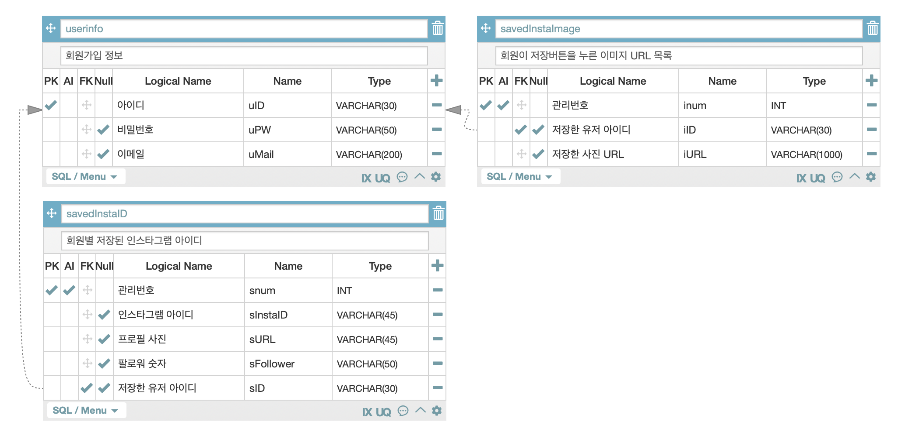

# StyleView Server

## Environment
- ubuntu 18.04 LTS
- python 3.7.5 (확정 - google-cloud-vision install 오류 없음)
- chrome 77.0.3865.120(공식 빌드) (64bit)
- google cloud vision api
- mysql
## Database table


## python packages
```cmd
pip install requirements.txt
```

## Run server
```cmd
python manage.py runserver
```

## Reference
- python & googleAPI를 이용한 인스타그램 크롤링
    - https://da-nika.tistory.com/21
- python selenium으로 웹 크롤링하기
    - https://github.com/rangyu/TIL/blob/master/python/%ED%8C%8C%EC%9D%B4%EC%8D%AC-Selenium%EC%9C%BC%EB%A1%9C-%EC%9B%B9-%ED%81%AC%EB%A1%A4%EB%A7%81%ED%95%98%EA%B8%B0.md
- 인스타그램 크롤링
    - https://eehoeskrap.tistory.com/335
- selenium + python
    - https://seongjaemoon.github.io/python/2018/05/16/python-course6.html
- selenium 공식 라이브러리
    - https://selenium.dev/selenium/docs/api/py/search.html?q=execute_script
- google cloud vision api 사용방법
    - https://blog.naver.com/rhrkdfus/221335357361
- google cloud api 설명
    - https://blog.naver.com/PostView.nhn?blogId=rhrkdfus&logNo=221335357361&parentCategoryNo=&categoryNo=40&viewDate=&isShowPopularPosts=true&from=search
- 비공개 계정 및 데이터 없는 계정 오류처리
    - http://allselenium.info/how-to-handle-exceptions-in-selenium-python-webdriver/

- google api 객체 탐지
    - https://cloud.google.com/vision/docs/detecting-objects#object-localization-local-python